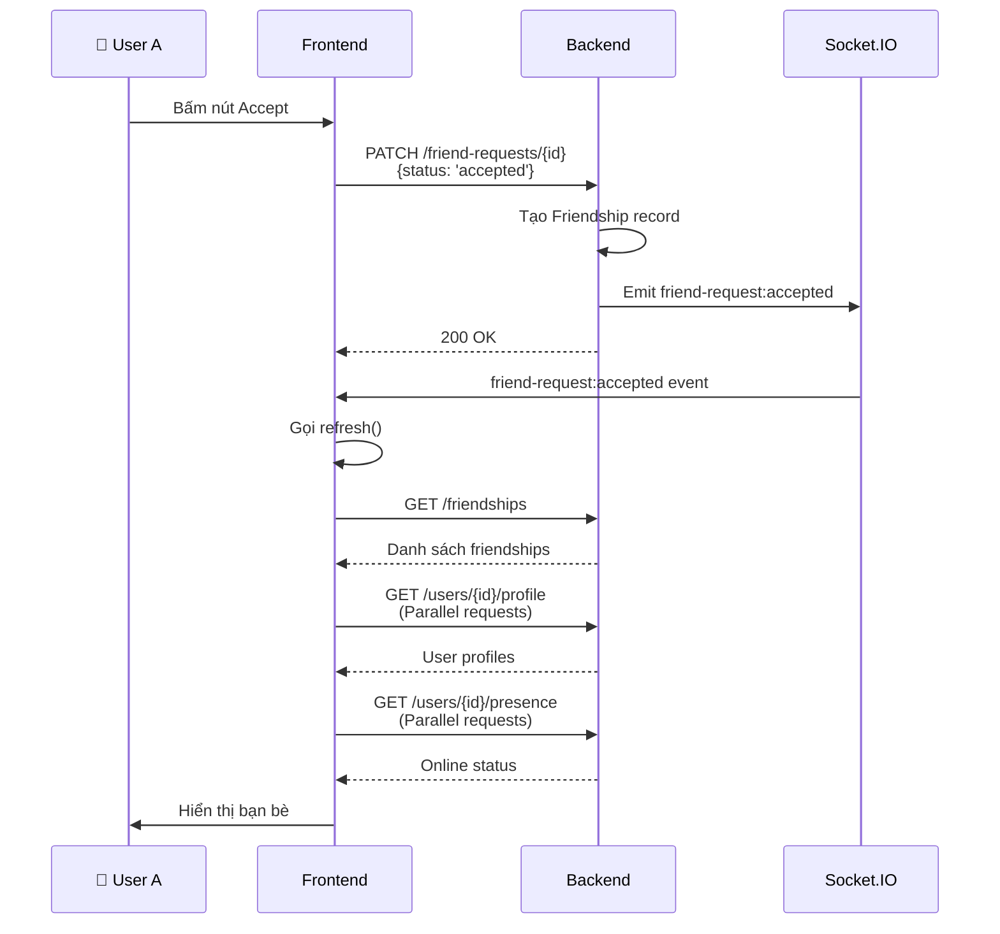

# Hiển thị Danh sách Bạn trên Home Page sau khi Kết bạn

**Câu hỏi:** Sau khi chấp nhận lời mời kết bạn, làm sao hiển thị người đó ở home page?

**Trả lời:** Sử dụng API `GET /v1/friendships` để lấy danh sách bạn bè cùng với thông tin profile của từng bạn.

---

## 1. API Endpoints

### 1.1 Lấy Danh sách Bạn bè

```http
GET /v1/friendships
Authorization: Bearer {token}
```

**Request:**
```javascript
const response = await fetch(
  'http://192.168.1.6:3000/v1/friendships?page=1&limit=20',
  {
    method: 'GET',
    headers: {
      'Authorization': `Bearer ${token}`,
    },
  }
);
const data = await response.json();
```

**Response:**
```json
{
  "data": {
    "items": [
      {
        "id": "friendship-id-1",
        "userA": "user-id-1",
        "userB": "user-id-2",
        "createdAt": "2026-04-11T10:00:00Z"
      },
      {
        "id": "friendship-id-2",
        "userA": "user-id-1",
        "userB": "user-id-3",
        "createdAt": "2026-04-11T10:05:00Z"
      }
    ],
    "total": 15,
    "page": 1,
    "limit": 20,
    "hasMore": false
  }
}
```

**Query Parameters:**
- `page` (optional, default: 1) - Trang hiện tại
- `limit` (optional, default: 20) - Số lượng bạn bè trên mỗi trang

---

### 1.2 Lấy Public Profile của Một Bạn bè

```http
GET /v1/users/:id/profile
Authorization: Bearer {token}
```

**Request:**
```javascript
const response = await fetch(
  `http://192.168.1.6:3000/v1/users/${userId}/profile`,
  {
    method: 'GET',
    headers: {
      'Authorization': `Bearer ${token}`,
    },
  }
);
const userProfile = await response.json();
```

**Response:**
```json
{
  "data": {
    "id": "user-id-2",
    "displayName": "Tên hiển thị",
    "avatarUrl": "https://...",
    "phoneNumber": "+84123456789",
    "bio": "Hello world",
    "location": "Hà Nội",
    "website": "https://...",
    "isPrivate": false,
    "createdAt": "2026-01-01T00:00:00Z",
    "updatedAt": "2026-04-11T10:00:00Z"
  }
}
```

---

### 1.3 Kiểm tra Trạng thái Online của Bạn bè

```http
GET /v1/users/:id/presence
Authorization: Bearer {token}
```

**Response:**
```json
{
  "data": {
    "userId": "user-id-2",
    "isOnline": true,
    "lastSeen": "2026-04-11T10:00:00Z"
  }
}
```

---

## 2. Flow Sau khi Chấp nhận Lời mời Kết bạn

### Flow Diagram

```mermaid
graph LR
    A["User chấp nhận<br/>lời mời kết bạn"] -->|PATCH /friend-requests/{id}| B["Backend tạo<br/>Friendship"]
    B -->|Emit socket event| C["friend-request:accepted"]
    C -->|FE nhận event| D["Fetch danh sách<br/>bạn bè mới"]
    D -->|GET /friendships| E["Server trả danh sách"]
    E -->|Fetch profile<br/>của từng bạn| F["GET /users/:id/profile"]
    F -->|Lấy được thông tin| G["Hiển thị bạn bè<br/>trên Home Page"]
    G -->|Check online| H["GET /users/:id/presence"]
    H -->|Cập nhật<br/>trạng thái| I["Hiển thị status<br/>online/offline"]
```

---

## 3. Service Layer Implementation

```typescript
// friendService.ts
import axios from 'axios';

const API_BASE = 'http://192.168.1.6:3000';

export interface FriendInfo {
  id: string;
  displayName: string;
  avatarUrl: string;
  phoneNumber: string;
  bio?: string;
  isOnline: boolean;
  lastSeen?: string;
  createdAt: string;
}

export interface FriendsListResponse {
  items: FriendInfo[];
  total: number;
  page: number;
  limit: number;
  hasMore: boolean;
}

export class FriendService {
  /**
   * Lấy danh sách bạn bè
   */
  static async getFriendships(
    page: number = 1,
    limit: number = 20,
    token: string
  ): Promise<FriendsListResponse> {
    console.log('[FriendService] Fetching friendships, page:', page);

    try {
      // Bước 1: Lấy danh sách friendship IDs
      const friendshipsResponse = await axios.get(
        `${API_BASE}/v1/friendships`,
        {
          params: { page, limit },
          headers: { 'Authorization': `Bearer ${token}` },
        }
      );

      const friendships = friendshipsResponse.data.data.items;
      const { total, hasMore } = friendshipsResponse.data.data;

      // Bước 2: Lấy current user ID từ token
      const currentUserId = await this.getUserIdFromToken(token);

      // Bước 3: Extract friend IDs từ friendships
      const friendIds = friendships.map((f: any) => {
        // userA và userB là sorted, nên ta lấy cái khác với current user
        return f.userA === currentUserId ? f.userB : f.userA;
      });

      console.log('[FriendService] Friend IDs:', friendIds);

      // Bước 4: Fetch profile của từng friend
      const friendProfiles = await Promise.all(
        friendIds.map((friendId) => this.getUserPublicProfile(friendId, token))
      );

      // Bước 5: Fetch online status của từng friend
      const friendsWithPresence = await Promise.all(
        friendProfiles.map((profile) => this.enrichWithPresence(profile, token))
      );

      console.log('[FriendService] Friends with profiles loaded:', friendsWithPresence);

      return {
        items: friendsWithPresence,
        total,
        page,
        limit,
        hasMore,
      };
    } catch (error) {
      console.error('[FriendService] Error fetching friendships:', error);
      throw error;
    }
  }

  /**
   * Lấy public profile của một user
   */
  private static async getUserPublicProfile(
    userId: string,
    token: string
  ): Promise<FriendInfo> {
    try {
      const response = await axios.get(
        `${API_BASE}/v1/users/${userId}/profile`,
        {
          headers: { 'Authorization': `Bearer ${token}` },
        }
      );

      const user = response.data.data;
      return {
        id: user.id,
        displayName: user.displayName,
        avatarUrl: user.avatarUrl,
        phoneNumber: user.phoneNumber,
        bio: user.bio,
        isOnline: false, // Will be updated later
        createdAt: user.createdAt,
      };
    } catch (error) {
      console.error(`[FriendService] Error fetching profile for user ${userId}:`, error);
      throw error;
    }
  }

  /**
   * Thêm thông tin presence vào friend info
   */
  private static async enrichWithPresence(
    friend: FriendInfo,
    token: string
  ): Promise<FriendInfo> {
    try {
      const response = await axios.get(
        `${API_BASE}/v1/users/${friend.id}/presence`,
        {
          headers: { 'Authorization': `Bearer ${token}` },
        }
      );

      const presence = response.data.data;
      return {
        ...friend,
        isOnline: presence.isOnline,
        lastSeen: presence.lastSeen,
      };
    } catch (error) {
      console.error(
        `[FriendService] Error fetching presence for user ${friend.id}:`,
        error
      );
      // Return friend without presence info
      return friend;
    }
  }

  /**
   * Lấy user ID từ JWT token
   */
  private static async getUserIdFromToken(token: string): Promise<string> {
    try {
      const response = await axios.get(`${API_BASE}/v1/users/profile`, {
        headers: { 'Authorization': `Bearer ${token}` },
      });
      return response.data.data.id;
    } catch (error) {
      console.error('[FriendService] Error getting user ID from token:', error);
      throw error;
    }
  }
}
```

---

## 4. Custom Hook for Friends List

```typescript
// useFriendsList.ts
import { useState, useEffect, useCallback } from 'react';
import { FriendService, FriendInfo, FriendsListResponse } from '../services/friendService';

interface UseFriendsListState {
  friends: FriendInfo[];
  loading: boolean;
  error: string | null;
  pagination: {
    page: number;
    limit: number;
    total: number;
    hasMore: boolean;
  };
}

export function useFriendsList(token: string) {
  const [state, setState] = useState<UseFriendsListState>({
    friends: [],
    loading: false,
    error: null,
    pagination: {
      page: 1,
      limit: 20,
      total: 0,
      hasMore: false,
    },
  });

  /**
   * Fetch danh sách bạn bè
   */
  const fetchFriends = useCallback(
    async (page: number = 1, limit: number = 20) => {
      setState((prev) => ({ ...prev, loading: true, error: null }));

      try {
        const response = await FriendService.getFriendships(page, limit, token);

        setState((prev) => ({
          ...prev,
          friends: response.items,
          loading: false,
          pagination: {
            page: response.page,
            limit: response.limit,
            total: response.total,
            hasMore: response.hasMore,
          },
        }));
      } catch (error) {
        const message = (error as Error).message || 'Failed to load friends';
        setState((prev) => ({
          ...prev,
          loading: false,
          error: message,
        }));
      }
    },
    [token]
  );

  /**
   * Reload danh sách bạn bè (ví dụ: sau khi chấp nhận lời mời)
   */
  const refresh = useCallback(() => {
    fetchFriends(state.pagination.page, state.pagination.limit);
  }, [fetchFriends, state.pagination.page, state.pagination.limit]);

  /**
   * Chuyển trang
   */
  const goToPage = useCallback(
    (page: number) => {
      fetchFriends(page, state.pagination.limit);
    },
    [fetchFriends, state.pagination.limit]
  );

  // Load friends khi component mount
  useEffect(() => {
    fetchFriends(1, 20);
  }, [fetchFriends]);

  return {
    friends: state.friends,
    loading: state.loading,
    error: state.error,
    pagination: state.pagination,
    refresh,
    goToPage,
  };
}
```

---

## 5. React Component Example - Friends List Screen

```typescript
// FriendsListScreen.tsx
import React, { useEffect } from 'react';
import {
  View,
  FlatList,
  Text,
  Image,
  TouchableOpacity,
  ActivityIndicator,
  StyleSheet,
} from 'react-native';
import { useFriendsList } from '../hooks/useFriendsList';
import { FriendInfo } from '../services/friendService';
import { useAuthStore } from '../store/authStore';

interface FriendCardProps {
  friend: FriendInfo;
  onPress: (friendId: string) => void;
}

const FriendCard: React.FC<FriendCardProps> = ({ friend, onPress }) => {
  const getStatusColor = (isOnline: boolean): string => {
    return isOnline ? '#4CAF50' : '#999999'; // Green if online, gray if offline
  };

  return (
    <TouchableOpacity
      style={styles.friendCard}
      onPress={() => onPress(friend.id)}
    >
      {/* Avatar */}
      <Image
        source={{ uri: friend.avatarUrl }}
        style={styles.avatar}
      />

      {/* Online Status Indicator */}
      <View
        style={[
          styles.statusIndicator,
          { backgroundColor: getStatusColor(friend.isOnline) },
        ]}
      />

      {/* Friend Info */}
      <View style={styles.friendInfo}>
        <Text style={styles.friendName}>{friend.displayName}</Text>
        <Text style={styles.friendPhone}>{friend.phoneNumber}</Text>
        {friend.bio && (
          <Text style={styles.friendBio} numberOfLines={1}>
            {friend.bio}
          </Text>
        )}

        {/* Status Badge */}
        <Text
          style={[
            styles.statusBadge,
            {
              color: friend.isOnline ? '#4CAF50' : '#999999',
              backgroundColor: friend.isOnline ? '#E8F5E9' : '#F5F5F5',
            },
          ]}
        >
          {friend.isOnline ? 'Online' : `Last seen: ${getTimeAgo(friend.lastSeen)}`}
        </Text>
      </View>

      {/* Action Button (Message/Call) */}
      <TouchableOpacity style={styles.actionButton}>
        <Text style={styles.actionText}>→</Text>
      </TouchableOpacity>
    </TouchableOpacity>
  );
};

const FriendsListScreen: React.FC = () => {
  const token = useAuthStore((state) => state.token);
  const { friends, loading, error, pagination, refresh, goToPage } =
    useFriendsList(token);

  const handleFriendPress = (friendId: string) => {
    console.log('Opening chat with friend:', friendId);
    // Navigate to chat screen
  };

  const renderFriend = ({ item }: { item: FriendInfo }) => (
    <FriendCard friend={item} onPress={handleFriendPress} />
  );

  const renderEmpty = () => (
    <View style={styles.emptyContainer}>
      <Text style={styles.emptyText}>Bạn chưa có bạn bè nào</Text>
      <Text style={styles.emptySubText}>
        Gửi lời mời kết bạn để bắt đầu kết nối
      </Text>
    </View>
  );

  const renderFooter = () => {
    if (!pagination.hasMore) return null;

    return (
      <TouchableOpacity
        style={styles.loadMoreButton}
        onPress={() => goToPage(pagination.page + 1)}
        disabled={loading}
      >
        {loading ? (
          <ActivityIndicator color="#007AFF" />
        ) : (
          <Text style={styles.loadMoreText}>Tải thêm</Text>
        )}
      </TouchableOpacity>
    );
  };

  return (
    <View style={styles.container}>
      {/* Header */}
      <View style={styles.header}>
        <Text style={styles.headerTitle}>Danh sách bạn bè</Text>
        <Text style={styles.headerSubtitle}>
          {pagination.total} bạn bè
        </Text>
      </View>

      {/* Loading State */}
      {loading && friends.length === 0 && (
        <View style={styles.centerContainer}>
          <ActivityIndicator size="large" color="#007AFF" />
          <Text style={styles.loadingText}>Đang tải danh sách bạn bè...</Text>
        </View>
      )}

      {/* Error State */}
      {error && (
        <View style={styles.errorContainer}>
          <Text style={styles.errorText}>⚠️ {error}</Text>
          <TouchableOpacity
            style={styles.retryButton}
            onPress={refresh}
          >
            <Text style={styles.retryText}>Thử lại</Text>
          </TouchableOpacity>
        </View>
      )}

      {/* Friends List */}
      {!loading && friends.length > 0 && (
        <FlatList
          data={friends}
          renderItem={renderFriend}
          keyExtractor={(friend) => friend.id}
          contentContainerStyle={styles.listContent}
          ListFooterComponent={renderFooter}
          onEndReachedThreshold={0.5}
          refreshing={loading}
          onRefresh={refresh}
        />
      )}

      {/* Empty State */}
      {!loading && friends.length === 0 && !error && renderEmpty()}
    </View>
  );
};

const styles = StyleSheet.create({
  container: {
    flex: 1,
    backgroundColor: '#f5f5f5',
  },
  header: {
    backgroundColor: '#fff',
    paddingHorizontal: 16,
    paddingVertical: 16,
    borderBottomWidth: 1,
    borderBottomColor: '#eee',
  },
  headerTitle: {
    fontSize: 24,
    fontWeight: 'bold',
    color: '#000',
  },
  headerSubtitle: {
    fontSize: 13,
    color: '#666',
    marginTop: 4,
  },
  listContent: {
    paddingHorizontal: 8,
    paddingVertical: 8,
  },
  friendCard: {
    flexDirection: 'row',
    alignItems: 'center',
    backgroundColor: '#fff',
    marginHorizontal: 8,
    marginVertical: 6,
    paddingHorizontal: 12,
    paddingVertical: 12,
    borderRadius: 8,
    shadowColor: '#000',
    shadowOffset: { width: 0, height: 1 },
    shadowOpacity: 0.1,
    shadowRadius: 3,
    elevation: 2,
  },
  avatar: {
    width: 50,
    height: 50,
    borderRadius: 25,
    backgroundColor: '#e0e0e0',
  },
  statusIndicator: {
    width: 12,
    height: 12,
    borderRadius: 6,
    position: 'absolute',
    bottom: 0,
    right: 35,
    borderWidth: 2,
    borderColor: '#fff',
  },
  friendInfo: {
    flex: 1,
    marginLeft: 12,
  },
  friendName: {
    fontSize: 16,
    fontWeight: '600',
    color: '#000',
  },
  friendPhone: {
    fontSize: 13,
    color: '#666',
    marginTop: 2,
  },
  friendBio: {
    fontSize: 12,
    color: '#999',
    marginTop: 2,
    fontStyle: 'italic',
  },
  statusBadge: {
    fontSize: 11,
    paddingHorizontal: 8,
    paddingVertical: 2,
    borderRadius: 4,
    marginTop: 4,
    alignSelf: 'flex-start',
  },
  actionButton: {
    width: 44,
    height: 44,
    borderRadius: 22,
    backgroundColor: '#F0F0F0',
    justifyContent: 'center',
    alignItems: 'center',
  },
  actionText: {
    fontSize: 20,
    color: '#007AFF',
  },
  emptyContainer: {
    flex: 1,
    justifyContent: 'center',
    alignItems: 'center',
    paddingHorizontal: 32,
  },
  emptyText: {
    fontSize: 16,
    fontWeight: '600',
    color: '#666',
  },
  emptySubText: {
    fontSize: 13,
    color: '#999',
    marginTop: 8,
    textAlign: 'center',
  },
  centerContainer: {
    flex: 1,
    justifyContent: 'center',
    alignItems: 'center',
  },
  loadingText: {
    marginTop: 12,
    fontSize: 14,
    color: '#666',
  },
  errorContainer: {
    backgroundColor: '#FFE0E0',
    marginHorizontal: 12,
    marginVertical: 12,
    paddingHorizontal: 12,
    paddingVertical: 16,
    borderRadius: 8,
    alignItems: 'center',
  },
  errorText: {
    fontSize: 14,
    color: '#CC0000',
  },
  retryButton: {
    marginTop: 8,
    backgroundColor: '#CC0000',
    paddingHorizontal: 16,
    paddingVertical: 8,
    borderRadius: 4,
  },
  retryText: {
    color: '#fff',
    fontWeight: '600',
    fontSize: 13,
  },
  loadMoreButton: {
    paddingVertical: 16,
    alignItems: 'center',
  },
  loadMoreText: {
    color: '#007AFF',
    fontWeight: '600',
    fontSize: 14,
  },
});

export default FriendsListScreen;
```

---

## 6. Socket.IO Real-time Integration

### 6.1 Listen for Friend Request Accepted Event

```typescript
// Socket.IO listener setup
import { io } from 'socket.io-client';

const socket = io('http://192.168.1.6:3000', {
  auth: {
    token: authToken,
  },
});

/**
 * Listen for friend request accepted event
 * Khi bạn chấp nhận lời mời hoặc ai đó chấp nhận lời mời của bạn
 */
socket.on('friend-request:accepted', (data: any) => {
  console.log('[Socket] Friend request accepted:', data);
  // {
  //   requestId,
  //   acceptedBy: userId,
  //   fromUserId,
  //   toUserId,
  // }

  // Reload danh sách bạn bè
  refreshFriendsList();
});

/**
 * Listen for friend added event
 */
socket.on('friend:added', (data: any) => {
  console.log('[Socket] New friendship created:', data);
  // Reload danh sách bạn bè
  refreshFriendsList();
});
```

### 6.2 Integrate with React Component

```typescript
// FriendsListScreen with Socket.IO
import { useEffect } from 'react';
import { io } from 'socket.io-client';

const FriendsListScreen: React.FC = () => {
  const token = useAuthStore((state) => state.token);
  const { friends, loading, error, pagination, refresh } = useFriendsList(token);

  useEffect(() => {
    // Setup socket connection
    const socket = io('http://192.168.1.6:3000', {
      auth: { token },
    });

    // Listen for friend request accepted
    socket.on('friend-request:accepted', () => {
      console.log('[Socket] Friend request accepted, refreshing list...');
      refresh(); // Refresh danh sách bạn bè
    });

    // Listen for new friendship
    socket.on('friend:added', () => {
      console.log('[Socket] New friend added, refreshing list...');
      refresh();
    });

    // Cleanup
    return () => {
      socket.disconnect();
    };
  }, [refresh, token]);

  // ... component render logic
};
```

---

## 7. Complete Flow After Accepting Friend Request



---

## 8. Complete Example: Accept & Refresh

```typescript
// Example: Component mà chứa Accept button và Friends list

import { useState } from 'react';
import { View, Text, Button } from 'react-native';
import { FriendRequestService } from '../services/friendRequestService';
import { useFriendsList } from '../hooks/useFriendsList';

interface Props {
  requestId: string;
  senderInfo: any;
  token: string;
}

export function FriendRequestCard({ requestId, senderInfo, token }: Props) {
  const [accepting, setAccepting] = useState(false);
  const { refresh: refreshFriends } = useFriendsList(token);

  const handleAccept = async () => {
    setAccepting(true);
    try {
      // Step 1: Accept friend request
      await FriendRequestService.acceptFriendRequest(requestId, token);
      console.log('✅ Friend request accepted');

      // Step 2: Refresh friends list
      await refreshFriends();
      console.log('✅ Friends list refreshed');

      // Step 3: Remove request from list (handled by state management)
    } catch (error) {
      console.error('❌ Failed to accept request:', error);
    } finally {
      setAccepting(false);
    }
  };

  return (
    <View>
      <Text>{senderInfo.displayName} đã gửi lời mời kết bạn</Text>
      <Button
        title={accepting ? 'Đang xử lý...' : 'Chấp nhận'}
        onPress={handleAccept}
        disabled={accepting}
      />
    </View>
  );
}
```

---

## 9. Debugging Checklist

- [ ] Verify `/v1/friendships` returns list of friendships
- [ ] Check friend IDs are correctly extracted (userA/userB)
- [ ] Confirm `/v1/users/:id/profile` returns user info
- [ ] Verify `/v1/users/:id/presence` returns online status
- [ ] Socket.IO event `friend-request:accepted` is received
- [ ] After accepting, friends list is refreshed automatically
- [ ] Avatar images load correctly
- [ ] Online status indicator updates in real-time
- [ ] Pagination works correctly
- [ ] Error handling displays proper messages
- [ ] Loading states work as expected

---

## 10. Summary

| Bước | Thao tác | API |
|------|---------|-----|
| 1 | Chấp nhận lời mời | PATCH `/v1/friend-requests/{id}` |
| 2 | Nhận socket event | Socket: `friend-request:accepted` |
| 3 | Lấy danh sách bạn bè | GET `/v1/friendships` |
| 4 | Lấy thông tin bạn | GET `/v1/users/{id}/profile` |
| 5 | Lấy trạng thái online | GET `/v1/users/{id}/presence` |
| 6 | Hiển thị danh sách | React komponenta với Avatar + Status |

---

## API Endpoints Summary

```bash
# Lấy danh sách bạn bè
GET http://192.168.1.6:3000/v1/friendships?page=1&limit=20
Header: Authorization: Bearer {token}

# Lấy public profile của một user
GET http://192.168.1.6:3000/v1/users/{userId}/profile
Header: Authorization: Bearer {token}

# Lấy online status của một user
GET http://192.168.1.6:3000/v1/users/{userId}/presence
Header: Authorization: Bearer {token}

# Chấp nhận lời mời kết bạn
PATCH http://192.168.1.6:3000/v1/friend-requests/{requestId}
Header: Authorization: Bearer {token}
Body: {"status":"accepted"}
```

---

## Đặc biệt: Pagination

Danh sách bạn bè hỗ trợ pagination:

```typescript
// Trang 1, 20 items mỗi trang
GET /v1/friendships?page=1&limit=20

// Response
{
  "data": {
    "items": [...],     // 20 items
    "total": 150,       // Tổng số bạn bè
    "page": 1,          // Trang hiện tại
    "limit": 20,        // Items per page
    "hasMore": true     // Có trang tiếp theo không
  }
}
```

Sử dụng `hasMore` để biết có nên hiển thị nút "Tải thêm" hay không.
