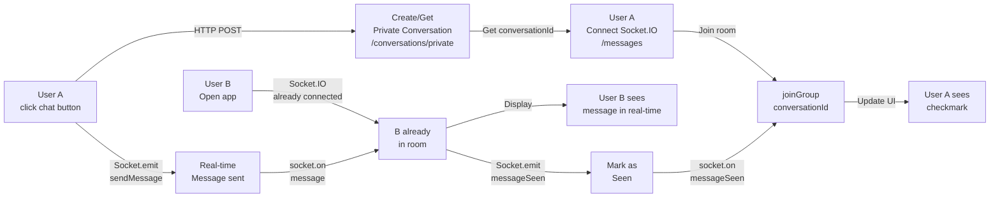
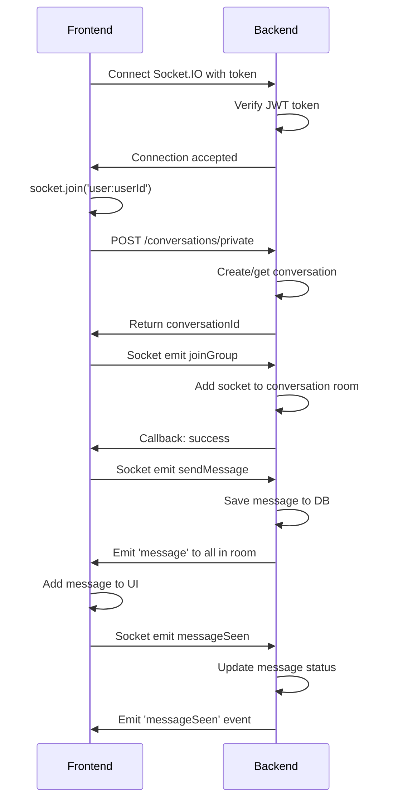

# Hướng dẫn Chat Real-time Giữa 2 User

**Câu hỏi:** Làm sao để 2 user chat real-time với nhau?

**Trả lời:** Sử dụng kết hợp HTTP API (REST) để tạo/lấy conversation và Socket.IO để gửi/nhận tin nhắn real-time.

---

## 1. Flow Chat Real-time

### Sơ đồ Chi tiết



---

## 2. Step-by-Step Implementation

### Step 1: Tạo hoặc Lấy Private Conversation

**API Endpoint:** `POST /v1/conversations/private`

```typescript
// conversationService.ts
import axios from 'axios';

const API_BASE = 'http://192.168.1.6:3000';

export interface Message {
  id: string;
  conversationId: string;
  senderId: string;
  content: string;
  attachments?: any[];
  status: 'sent' | 'delivered' | 'seen';
  createdAt: string;
  updatedAt: string;
}

export interface Conversation {
  id: string;
  type: 'private' | 'group';
  members: string[];
  lastMessage?: Message;
  unreadCount: number;
  createdAt: string;
}

export class ConversationService {
  /**
   * Tạo hoặc lấy private conversation với một user khác
   */
  static async getOrCreatePrivateConversation(
    otherUserId: string,
    token: string
  ): Promise<Conversation> {
    console.log('[ConversationService] Creating/getting private conversation with:', otherUserId);

    try {
      const response = await axios.post(
        `${API_BASE}/v1/conversations/private`,
        { otherUserId },
        {
          headers: {
            'Authorization': `Bearer ${token}`,
            'Content-Type': 'application/json',
          },
        }
      );

      console.log('[ConversationService] Response:', response.data);
      return response.data.data;
    } catch (error) {
      console.error('[ConversationService] Error:', error);
      throw error;
    }
  }

  /**
   * Lấy danh sách conversations của current user
   */
  static async getConversations(token: string, page: number = 1, limit: number = 20) {
    try {
      const response = await axios.get(
        `${API_BASE}/v1/conversations?page=${page}&limit=${limit}`,
        {
          headers: { 'Authorization': `Bearer ${token}` },
        }
      );
      return response.data.data;
    } catch (error) {
      console.error('[ConversationService] Error fetching conversations:', error);
      throw error;
    }
  }

  /**
   * Lấy chi tiết conversation
   */
  static async getConversationDetail(conversationId: string, token: string) {
    try {
      const response = await axios.get(
        `${API_BASE}/v1/conversations/${conversationId}`,
        {
          headers: { 'Authorization': `Bearer ${token}` },
        }
      );
      return response.data.data;
    } catch (error) {
      console.error('[ConversationService] Error fetching detail:', error);
      throw error;
    }
  }

  /**
   * Load tin nhắn cũ từ conversation
   */
  static async loadMessages(
    conversationId: string,
    token: string,
    page: number = 1,
    limit: number = 20
  ) {
    try {
      const response = await axios.get(
        `${API_BASE}/v1/conversations/${conversationId}/messages?page=${page}&limit=${limit}`,
        {
          headers: { 'Authorization': `Bearer ${token}` },
        }
      );
      return response.data.data;
    } catch (error) {
      console.error('[ConversationService] Error loading messages:', error);
      throw error;
    }
  }
}
```

**Request:**
```bash
curl -X POST http://192.168.1.6:3000/v1/conversations/private \
  -H "Authorization: Bearer {token}" \
  -H "Content-Type: application/json" \
  -d '{"otherUserId":"user-id-of-friend"}'
```

**Response:**
```json
{
  "data": {
    "id": "conv_123abc",
    "type": "private",
    "members": ["user-id-1", "user-id-2"],
    "lastMessage": {
      "id": "msg_001",
      "content": "Hello!",
      "status": "seen",
      "createdAt": "2026-04-12T10:00:00Z"
    },
    "unreadCount": 0,
    "createdAt": "2026-04-12T09:00:00Z"
  }
}
```

---

### Step 2: Kết nối Socket.IO

```typescript
// socketService.ts
import { io, Socket } from 'socket.io-client';

const SOCKET_URL = 'http://192.168.1.6:3000';
const SOCKET_NAMESPACE = '/messages';

export class SocketService {
  private static socket: Socket | null = null;

  /**
   * Kết nối Socket.IO với server
   */
  static connect(token: string): Socket {
    if (this.socket?.connected) {
      console.log('[SocketService] Already connected');
      return this.socket;
    }

    console.log('[SocketService] Connecting to', SOCKET_URL + SOCKET_NAMESPACE);

    this.socket = io(SOCKET_URL + SOCKET_NAMESPACE, {
      auth: {
        token, // JWT token
      },
      transports: ['websocket'],
      reconnection: true,
      reconnectionAttempts: 5,
      reconnectionDelay: 1000,
      reconnectionDelayMax: 5000,
    });

    // Connection events
    this.socket.on('connect', () => {
      console.log('[SocketService] ✅ Connected with ID:', this.socket?.id);
    });

    this.socket.on('disconnect', (reason) => {
      console.log('[SocketService] ❌ Disconnected:', reason);
    });

    this.socket.on('connect_error', (error) => {
      console.error('[SocketService] Connection error:', error);
    });

    return this.socket;
  }

  /**
   * Disconnect socket
   */
  static disconnect() {
    if (this.socket) {
      this.socket.disconnect();
      this.socket = null;
      console.log('[SocketService] Disconnected');
    }
  }

  /**
   * Get current socket instance
   */
  static getSocket(): Socket | null {
    return this.socket;
  }

  /**
   * Check if connected
   */
  static isConnected(): boolean {
    return !!this.socket?.connected;
  }
}
```

---

### Step 3: Join Conversation Room

```typescript
/**
 * Tham gia nhóm/conversation qua Socket.IO
 */
static joinConversation(conversationId: string): Promise<void> {
  return new Promise((resolve, reject) => {
    if (!this.socket) {
      reject(new Error('Socket not connected'));
      return;
    }

    console.log('[SocketService] Joining conversation:', conversationId);

    this.socket.emit('joinGroup', { conversationId }, (response: any) => {
      if (response?.success) {
        console.log('[SocketService] ✅ Joined conversation:', conversationId);
        resolve();
      } else {
        console.error('[SocketService] Failed to join:', response?.error);
        reject(new Error(response?.error || 'Failed to join conversation'));
      }
    });
  });
}

/**
 * Rời khỏi conversation room
 */
static leaveConversation(conversationId: string): Promise<void> {
  return new Promise((resolve, reject) => {
    if (!this.socket) {
      reject(new Error('Socket not connected'));
      return;
    }

    this.socket.emit('leaveGroup', { conversationId }, (response: any) => {
      if (response?.success) {
        console.log('[SocketService] Left conversation:', conversationId);
        resolve();
      } else {
        reject(new Error(response?.error || 'Failed to leave'));
      }
    });
  });
}
```

---

### Step 4: Gửi Tin Nhắn Real-time

```typescript
export interface SendMessagePayload {
  conversationId: string;
  content: string;
  attachments?: any[];
  mentions?: string[];
  quotedMessageId?: string;
}

/**
 * Gửi tin nhắn qua Socket.IO (Real-time)
 */
static sendMessage(
  conversationId: string,
  content: string,
  attachments?: any[]
): Promise<Message> {
  return new Promise((resolve, reject) => {
    if (!this.socket) {
      reject(new Error('Socket not connected'));
      return;
    }

    const payload: SendMessagePayload = {
      conversationId,
      content,
      attachments: attachments || [],
    };

    console.log('[SocketService] Sending message:', payload);

    // Gửi qua Socket.IO
    this.socket.emit('sendMessage', payload, (response: any) => {
      if (response?.success) {
        console.log('[SocketService] ✅ Message sent:', response.data);
        resolve(response.data);
      } else {
        console.error('[SocketService] Failed to send:', response?.error);
        reject(new Error(response?.error || 'Failed to send message'));
      }
    });
  });
}

/**
 * Lắng nghe tin nhắn mới từ server
 */
static onMessage(callback: (message: Message) => void) {
  if (!this.socket) {
    console.error('[SocketService] Socket not connected');
    return;
  }

  this.socket.on('message', (message: Message) => {
    console.log('[SocketService] 📨 New message received:', message);
    callback(message);
  });
}

/**
 * Bỏ lắng nghe tin nhắn
 */
static offMessage() {
  if (this.socket) {
    this.socket.off('message');
  }
}

/**
 * Lắng nghe tin nhắn được cập nhật (edit, delete, etc)
 */
static onMessageUpdated(callback: (message: Message) => void) {
  if (!this.socket) {
    console.error('[SocketService] Socket not connected');
    return;
  }

  this.socket.on('messageUpdated', (message: Message) => {
    console.log('[SocketService] ✏️ Message updated:', message);
    callback(message);
  });
}
```

---

### Step 5: Đánh Dấu Tin Nhắn Đã Xem

```typescript
/**
 * Đánh dấu tin nhắn đã xem
 */
static markMessageAsRead(
  conversationId: string,
  messageIds: string[]
): Promise<void> {
  return new Promise((resolve, reject) => {
    if (!this.socket) {
      reject(new Error('Socket not connected'));
      return;
    }

    this.socket.emit(
      'messageSeen',
      { conversationId, messageIds },
      (response: any) => {
        if (response?.success) {
          console.log('[SocketService] ✅ Messages marked as read');
          resolve();
        } else {
          reject(new Error(response?.error || 'Failed to mark as read'));
        }
      }
    );
  });
}

/**
 * Lắng nghe sự kiện tin nhắn được xem
 */
static onMessageSeen(callback: (data: any) => void) {
  if (!this.socket) return;

  this.socket.on('messageSeen', (data) => {
    console.log('[SocketService] ✔️ Message seen by:', data);
    callback(data);
  });
}
```

---

### Step 6: Typing Indicator

```typescript
/**
 * Gửi sự kiện đang gõ
 */
static startTyping(conversationId: string) {
  if (!this.socket) return;

  this.socket.emit('typing:start', { conversationId });
  console.log('[SocketService] Typing started in:', conversationId);
}

/**
 * Gửi sự kiện dừng gõ
 */
static stopTyping(conversationId: string) {
  if (!this.socket) return;

  this.socket.emit('typing:stop', { conversationId });
}

/**
 * Lắng nghe sự kiện khi người khác đang gõ
 */
static onTyping(callback: (data: any) => void) {
  if (!this.socket) return;

  this.socket.on('typing:start', (data) => {
    console.log('[SocketService] User typing:', data);
    callback({ ...data, isTyping: true });
  });

  this.socket.on('typing:stop', (data) => {
    console.log('[SocketService] User stopped typing:', data);
    callback({ ...data, isTyping: false });
  });
}
```

---

## 3. Custom Hook for Chat

```typescript
// useChatMessage.ts
import { useState, useEffect, useCallback, useRef } from 'react';
import { Message, Conversation } from '../services/conversationService';
import { SocketService } from '../services/socketService';
import { ConversationService } from '../services/conversationService';

interface UseChatMessageState {
  conversation: Conversation | null;
  messages: Message[];
  loading: boolean;
  error: string | null;
  typingUsers: Set<string>; // Users currently typing
}

export function useChatMessage(
  friendId: string,
  token: string
) {
  const [state, setState] = useState<UseChatMessageState>({
    conversation: null,
    messages: [],
    loading: false,
    error: null,
    typingUsers: new Set(),
  });

  const typingTimeoutRef = useRef<NodeJS.Timeout | null>(null);

  /**
   * Initialize - Create/get conversation and connect Socket.IO
   */
  useEffect(() => {
    const initialize = async () => {
      setState((prev) => ({ ...prev, loading: true }));

      try {
        // Step 1: Connect Socket.IO
        const socket = SocketService.connect(token);
        console.log('[useChatMessage] Socket connected');

        // Step 2: Create/get conversation
        const conversation = await ConversationService.getOrCreatePrivateConversation(
          friendId,
          token
        );
        console.log('[useChatMessage] Conversation created:', conversation.id);

        // Step 3: Load previous messages
        const messagesResponse = await ConversationService.loadMessages(
          conversation.id,
          token
        );

        // Step 4: Join conversation room
        await SocketService.joinConversation(conversation.id);

        setState((prev) => ({
          ...prev,
          conversation,
          messages: messagesResponse.items || [],
          loading: false,
        }));

        // Step 5: Setup Socket.IO event listeners
        SocketService.onMessage((message: Message) => {
          setState((prev) => ({
            ...prev,
            messages: [message, ...prev.messages],
          }));
        });

        SocketService.onMessageSeen((data: any) => {
          setState((prev) => ({
            ...prev,
            messages: prev.messages.map((msg) =>
              data.messageIds?.includes(msg.id)
                ? { ...msg, status: 'seen' }
                : msg
            ),
          }));
        });

        SocketService.onTyping((data: any) => {
          setState((prev) => {
            const newTypingUsers = new Set(prev.typingUsers);
            if (data.isTyping) {
              newTypingUsers.add(data.userId);
            } else {
              newTypingUsers.delete(data.userId);
            }
            return { ...prev, typingUsers: newTypingUsers };
          });
        });
      } catch (error) {
        const message = (error as Error).message || 'Failed to initialize chat';
        setState((prev) => ({
          ...prev,
          error: message,
          loading: false,
        }));
      }
    };

    initialize();

    // Cleanup
    return () => {
      if (state.conversation) {
        SocketService.leaveConversation(state.conversation.id).catch(console.error);
      }
      SocketService.offMessage();
    };
  }, [friendId, token]);

  /**
   * Gửi tin nhắn
   */
  const sendMessage = useCallback(
    async (content: string, attachments?: any[]) => {
      if (!state.conversation) {
        setState((prev) => ({
          ...prev,
          error: 'Conversation not initialized',
        }));
        return;
      }

      try {
        setState((prev) => ({ ...prev, error: null }));
        SocketService.stopTyping(state.conversation!.id);

        const message = await SocketService.sendMessage(
          state.conversation.id,
          content,
          attachments
        );

        console.log('[useChatMessage] Message sent:', message);
        // Message will be added via onMessage listener
      } catch (error) {
        const message = (error as Error).message || 'Failed to send message';
        setState((prev) => ({ ...prev, error: message }));
      }
    },
    [state.conversation]
  );

  /**
   * Đánh dấu tin nhắn đã xem
   */
  const markAsRead = useCallback(
    async (messageIds: string[]) => {
      if (!state.conversation) return;

      try {
        await SocketService.markMessageAsRead(
          state.conversation.id,
          messageIds
        );
      } catch (error) {
        console.error('[useChatMessage] Failed to mark as read:', error);
      }
    },
    [state.conversation]
  );

  /**
   * Handle typing indicator
   */
  const handleTyping = useCallback(() => {
    if (!state.conversation) return;

    SocketService.startTyping(state.conversation.id);

    // Clear previous timeout
    if (typingTimeoutRef.current) {
      clearTimeout(typingTimeoutRef.current);
    }

    // Stop typing after 3 seconds of inactivity
    typingTimeoutRef.current = setTimeout(() => {
      SocketService.stopTyping(state.conversation!.id);
    }, 3000);
  }, [state.conversation]);

  /**
   * Load more messages (pagination)
   */
  const loadMoreMessages = useCallback(
    async (page: number) => {
      if (!state.conversation) return;

      try {
        const response = await ConversationService.loadMessages(
          state.conversation.id,
          token,
          page
        );

        setState((prev) => ({
          ...prev,
          messages: [...prev.messages, ...(response.items || [])],
        }));
      } catch (error) {
        console.error('[useChatMessage] Failed to load more:', error);
      }
    },
    [state.conversation, token]
  );

  return {
    conversation: state.conversation,
    messages: state.messages,
    loading: state.loading,
    error: state.error,
    typingUsers: state.typingUsers,
    sendMessage,
    markAsRead,
    handleTyping,
    loadMoreMessages,
  };
}
```

---

## 4. React Component - Chat Screen

```typescript
// ChatScreen.tsx
import React, { useEffect, useState } from 'react';
import {
  View,
  FlatList,
  TextInput,
  TouchableOpacity,
  Text,
  StyleSheet,
  KeyboardAvoidingView,
  Image,
  ActivityIndicator,
} from 'react-native';
import { useChatMessage } from '../hooks/useChatMessage';
import { Message } from '../services/conversationService';
import { useAuthStore } from '../store/authStore';

interface ChatScreenProps {
  friendId: string;
  friendName: string;
  friendAvatar: string;
}

const MessageBubble: React.FC<{
  message: Message;
  isSender: boolean;
}> = ({ message, isSender }) => {
  const getStatusIcon = (status: string) => {
    switch (status) {
      case 'sent':
        return '✓';
      case 'delivered':
        return '✓✓';
      case 'seen':
        return '✓✓'; // Blue checkmark
      default:
        return '';
    }
  };

  return (
    <View
      style={[
        styles.messageBubble,
        isSender ? styles.senderBubble : styles.receiverBubble,
      ]}
    >
      <Text style={[styles.messageText, !isSender && styles.receiverText]}>
        {message.content}
      </Text>

      {isSender && (
        <View style={styles.messageFooter}>
          <Text
            style={[
              styles.timestamp,
              message.status === 'seen' && styles.seenTimestamp,
            ]}
          >
            {getStatusIcon(message.status)}
          </Text>
          <Text style={styles.timestamp}>
            {new Date(message.createdAt).toLocaleTimeString()}
          </Text>
        </View>
      )}
    </View>
  );
};

const TypingIndicator = () => (
  <View style={styles.typingContainer}>
    <View style={styles.typingDot} />
    <View style={[styles.typingDot, { animationDelay: '0.2s' }]} />
    <View style={[styles.typingDot, { animationDelay: '0.4s' }]} />
  </View>
);

const ChatScreen: React.FC<ChatScreenProps> = ({
  friendId,
  friendName,
  friendAvatar,
}) => {
  const token = useAuthStore((state) => state.token);
  const userId = useAuthStore((state) => state.user?.id);

  const {
    conversation,
    messages,
    loading,
    error,
    typingUsers,
    sendMessage,
    markAsRead,
    handleTyping,
  } = useChatMessage(friendId, token);

  const [inputText, setInputText] = useState('');
  const [sending, setSending] = useState(false);

  const handleSendMessage = async () => {
    if (!inputText.trim()) return;

    setSending(true);
    try {
      await sendMessage(inputText.trim());
      setInputText('');
    } catch (error) {
      console.error('Failed to send message:', error);
    } finally {
      setSending(false);
    }
  };

  const renderMessage = ({ item, index }: { item: Message; index: number }) => {
    const isSender = item.senderId === userId;

    // Mark as seen when visible
    useEffect(() => {
      if (!isSender && item.status !== 'seen') {
        markAsRead([item.id]);
      }
    }, [isSender, item]);

    return (
      <MessageBubble
        message={item}
        isSender={isSender}
      />
    );
  };

  const renderTypingIndicator = () => {
    if (typingUsers.size === 0) return null;

    return (
      <View style={styles.typingIndicatorContainer}>
        <TypingIndicator />
        <Text style={styles.typingText}>
          {friendName} is typing...
        </Text>
      </View>
    );
  };

  if (loading) {
    return (
      <View style={styles.centerContainer}>
        <ActivityIndicator size="large" color="#007AFF" />
      </View>
    );
  }

  if (error) {
    return (
      <View style={styles.centerContainer}>
        <Text style={styles.errorText}>❌ {error}</Text>
      </View>
    );
  }

  return (
    <KeyboardAvoidingView
      style={styles.container}
      behavior="padding"
    >
      {/* Header */}
      <View style={styles.header}>
        <Image
          source={{ uri: friendAvatar }}
          style={styles.headerAvatar}
        />
        <Text style={styles.headerName}>{friendName}</Text>
      </View>

      {/* Messages List */}
      <FlatList
        data={messages}
        renderItem={renderMessage}
        keyExtractor={(msg) => msg.id}
        inverted
        contentContainerStyle={styles.messagesContent}
        ListFooterComponent={renderTypingIndicator}
      />

      {/* Input Area */}
      <View style={styles.inputArea}>
        <TextInput
          style={styles.input}
          placeholder="Aa"
          value={inputText}
          onChangeText={(text) => {
            setInputText(text);
            handleTyping(); // Emit typing event
          }}
          multiline
          maxLength={1000}
          editable={!sending}
        />

        <TouchableOpacity
          style={[
            styles.sendButton,
            (!inputText.trim() || sending) && styles.sendButtonDisabled,
          ]}
          onPress={handleSendMessage}
          disabled={!inputText.trim() || sending}
        >
          {sending ? (
            <ActivityIndicator color="#fff" />
          ) : (
            <Text style={styles.sendButtonText}>➤</Text>
          )}
        </TouchableOpacity>
      </View>
    </KeyboardAvoidingView>
  );
};

const styles = StyleSheet.create({
  container: {
    flex: 1,
    backgroundColor: '#fff',
  },
  centerContainer: {
    flex: 1,
    justifyContent: 'center',
    alignItems: 'center',
  },
  errorText: {
    fontSize: 16,
    color: '#CC0000',
  },
  header: {
    flexDirection: 'row',
    alignItems: 'center',
    paddingHorizontal: 16,
    paddingVertical: 12,
    borderBottomWidth: 1,
    borderBottomColor: '#eee',
    backgroundColor: '#fff',
  },
  headerAvatar: {
    width: 40,
    height: 40,
    borderRadius: 20,
    backgroundColor: '#e0e0e0',
  },
  headerName: {
    marginLeft: 12,
    fontSize: 16,
    fontWeight: '600',
    color: '#000',
  },
  messagesContent: {
    paddingHorizontal: 12,
    paddingVertical: 8,
  },
  messageBubble: {
    maxWidth: '80%',
    marginVertical: 4,
    paddingHorizontal: 12,
    paddingVertical: 8,
    borderRadius: 12,
  },
  senderBubble: {
    alignSelf: 'flex-end',
    backgroundColor: '#007AFF',
    marginRight: 8,
  },
  receiverBubble: {
    alignSelf: 'flex-start',
    backgroundColor: '#E8E8E8',
    marginLeft: 8,
  },
  messageText: {
    fontSize: 14,
    color: '#fff',
  },
  receiverText: {
    color: '#000',
  },
  messageFooter: {
    flexDirection: 'row',
    alignItems: 'center',
    marginTop: 4,
  },
  timestamp: {
    fontSize: 11,
    color: '#fff',
    marginLeft: 4,
    opacity: 0.7,
  },
  seenTimestamp: {
    color: '#90EE90', // Light green for seen
  },
  typingIndicatorContainer: {
    flexDirection: 'row',
    alignItems: 'center',
    marginVertical: 8,
    marginLeft: 8,
  },
  typingContainer: {
    flexDirection: 'row',
    alignItems: 'center',
    height: 20,
  },
  typingDot: {
    width: 8,
    height: 8,
    borderRadius: 4,
    backgroundColor: '#999',
    marginHorizontal: 2,
  },
  typingText: {
    fontSize: 12,
    color: '#999',
    marginLeft: 8,
  },
  inputArea: {
    flexDirection: 'row',
    alignItems: 'flex-end',
    paddingHorizontal: 8,
    paddingVertical: 8,
    borderTopWidth: 1,
    borderTopColor: '#eee',
  },
  input: {
    flex: 1,
    minHeight: 40,
    maxHeight: 100,
    paddingHorizontal: 12,
    paddingVertical: 8,
    backgroundColor: '#f5f5f5',
    borderRadius: 20,
    marginRight: 8,
    fontSize: 14,
  },
  sendButton: {
    width: 40,
    height: 40,
    borderRadius: 20,
    backgroundColor: '#007AFF',
    justifyContent: 'center',
    alignItems: 'center',
  },
  sendButtonDisabled: {
    backgroundColor: '#ccc',
  },
  sendButtonText: {
    fontSize: 18,
    color: '#fff',
  },
});

export default ChatScreen;
```

---

## 5. Socket.IO Events Summary

### Client -> Server (Send)

| Event | Payload | Mô tả |
|-------|---------|-------|
| `joinGroup` | `{conversationId}` | Tham gia conversation room |
| `leaveGroup` | `{conversationId}` | Rời conversation room |
| `sendMessage` | `{conversationId, content, attachments}` | Gửi tin nhắn |
| `messageSeen` | `{conversationId, messageIds}` | Đánh dấu đã xem |
| `typing:start` | `{conversationId}` | Bắt đầu gõ |
| `typing:stop` | `{conversationId}` | Dừng gõ |
| `editMessage` | `{messageId, content}` | Chỉnh sửa tin nhắn |
| `deleteMessage` | `{messageId}` | Xóa tin nhắn cho mình |
| `addReaction` | `{messageId, emoji}` | Thêm reaction |

### Server -> Client (Receive)

| Event | Data | Mô tả |
|-------|------|-------|
| `message` | `Message object` | Tin nhắn mới |
| `messageUpdated` | `Message object` | Tin nhắn được cập nhật |
| `messageSeen` | `{messageIds, userId}` | Tin nhắn được xem |
| `typing:start` | `{conversationId, userId}` | Ai đó đang gõ |
| `typing:stop` | `{conversationId, userId}` | Ai đó dừng gõ |
| `reactionAdded` | `{messageId, emoji, userId}` | Reaction được thêm |

---

## 6. Complete Flow Example

```typescript
// UseChatFlow.tsx - Complete example

import { useState } from 'react';
import { View, Button, Text } from 'react-native';
import ChatScreen from './ChatScreen';
import { useAuthStore } from '../store/authStore';

export function UseChatFlow() {
  const user = useAuthStore((state) => state.user);
  const [selectedFriendId, setSelectedFriendId] = useState<string | null>(null);

  if (!user) {
    return <Text>Please login first</Text>;
  }

  if (selectedFriendId) {
    return (
      <ChatScreen
        friendId={selectedFriendId}
        friendName="Friend Name"
        friendAvatar="https://..."
      />
    );
  }

  // Show friend list
  return (
    <View>
      <Text>Select a friend to chat</Text>
      {/* Map through friends and create buttons */}
      <Button
        title="Chat with John"
        onPress={() => setSelectedFriendId('john-id')}
      />
    </View>
  );
}
```

---

## 7. Debugging Checklist

- [ ] Socket.IO connects successfully with token
- [ ] `joinGroup` callback returns success
- [ ] Messages are received in real-time via `message` event
- [ ] Typing indicator shows when user types
- [ ] Message status changes (sent -> delivered -> seen)
- [ ] Checkmark appears when friend reads message
- [ ] Previous messages load correctly
- [ ] Conversation is created if doesn't exist
- [ ] Error handling displays proper messages
- [ ] Socket disconnect handled gracefully

---

## 8. API Endpoints Summary

| Method | Endpoint | Purpose |
|--------|----------|---------|
| `POST` | `/v1/conversations/private` | Tạo/lấy private conversation |
| `GET` | `/v1/conversations` | Lấy danh sách conversations |
| `GET` | `/v1/conversations/:id` | Lấy chi tiết conversation |
| `GET` | `/v1/conversations/:id/messages` | Lấy tin nhắn |
| `POST` | `/v1/conversations/:id/messages` | Gửi tin nhắn (HTTP, không dùng) |

---

## 9. Socket.IO Connection Steps



---

## 10. Key Points

✅ **Private Conversation Flow:**
1. Call `/conversations/private` API to get/create conversation
2. Connect Socket.IO if not already connected
3. Call `joinGroup` event to enter the room
4. Send/receive messages via Socket.IO `sendMessage` and `message` events
5. Mark messages as seen via `messageSeen` event

✅ **Real-time Features:**
- Instant message delivery via WebSocket
- Typing indicators without polling
- Message status (sent, delivered, seen)
- Message reactions and edits in real-time

✅ **Best Practices:**
- Always join conversation before sending messages
- Handle Socket.IO disconnection/reconnection
- Mark messages as read when visible
- Show typing indicators with timeout
- Implement pagination for old messages

